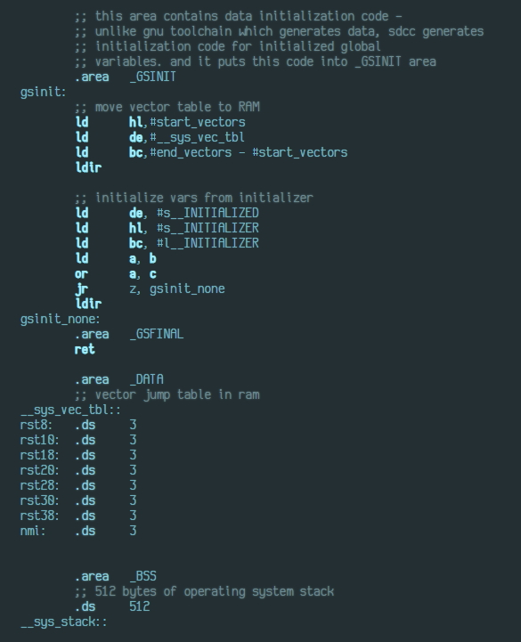

![status.badge] [![language.badge]][language.url] [![license.badge]][license.url]

# z80high

Pure JavaScript code for highlighting [Z80](http://www.zilog.com/docs/z80/um0080.pdf) assembly on your page. 
It recognizes plain Z80 and [SDCC](http://sdcc.sourceforge.net/) assembly directives.

# Usage

To use the syntax highlighter, copy three files from the repository into your project:
 * The stylesheet `css/z80high.css`
 * The JavaScript code `js/z80high.js` and
 * The woff font `font/luculent.woff` 

Add stylesheet and JavaScript to your html and put your code into a `pre lang="z80"` block.

~~~
<!DOCTYPE html>
<html>
<head>
    <link rel='stylesheet' type='text/css' href='css/z80high.css'>
    
</head>
<body>
    <pre lang="z80">
        ;; sample z80 code
        .org    0x8000
        ld      a,#0xaa
        ld      hl,#16384
        ld      (hl),a
        ret</pre>
</body>
</html>
~~~

[language.url]:   https://en.wikipedia.org/wiki/JavaScript
[language.badge]: https://img.shields.io/badge/language-JavaScript-blue.svg

[license.url]:    https://github.com/tstih/nice/blob/master/LICENSE
[license.badge]:  https://img.shields.io/badge/license-MIT-blue.svg

[status.badge]:  https://img.shields.io/badge/status-stable-green.svg
